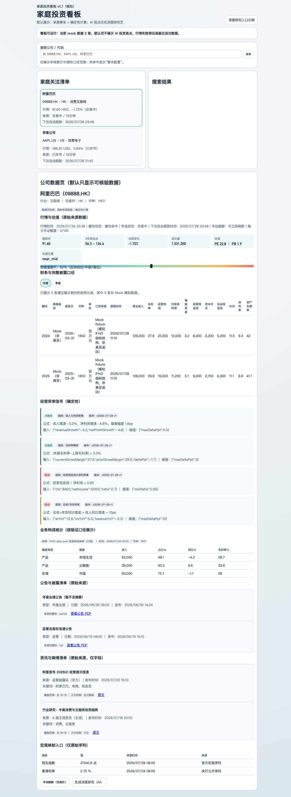
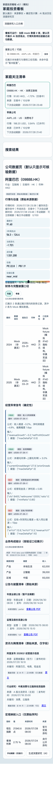
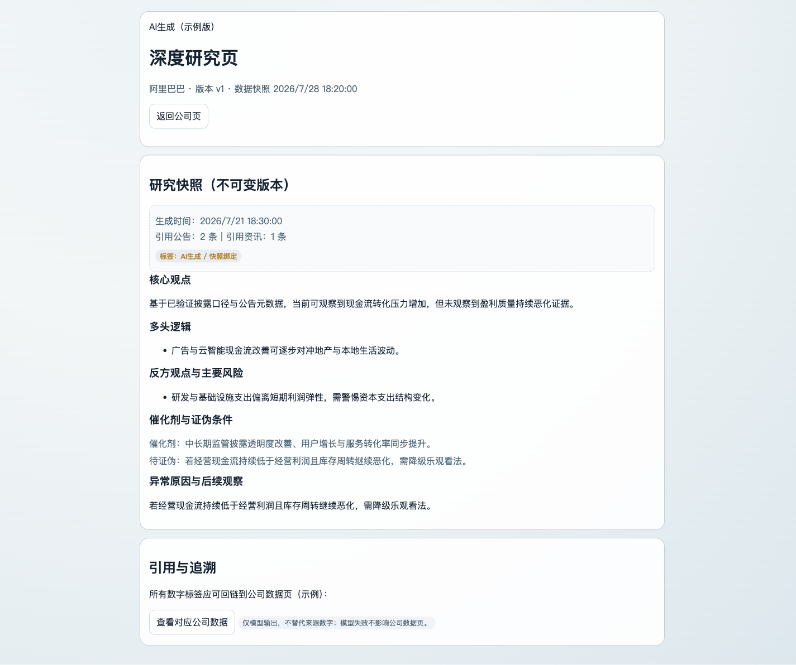

# Task 6 视觉验收记录

验收日期：2026-07-29

## 验收环境

| 项目 | 实际配置 |
| --- | --- |
| 浏览器 | Playwright 驱动的 Chromium 真实浏览器 |
| 桌面视口 | 1440 x 1000 |
| 手机视口 | 390 x 844 |
| 验收页面 | 首页、深度研究页 |

## 验收结果

- 首页和深度研究页均完成桌面与手机视口检查。
- 首页季度切换可用，并能显示已有季度 Mock fixture 数据。
- 浏览器控制台错误数为 0。
- 手机首页 `document.scrollWidth = 375`，不超过 `viewport width = 390`。
- 手机首页财务表格内部滚动尺寸为 `scrollWidth/clientWidth = 1024/301`。
- 手机首页业务细分表格内部滚动尺寸为 `scrollWidth/clientWidth = 680/301`。
- 两个表格保持独立横向滚动，未造成页面级横向溢出。
- 财务数据逐行明确显示 `Mock（非真实）`，来源为 `Mock fixture（模拟 iFinD 指标结构，非真实返回）`。

## 最终截图

### 首页桌面

### 首页手机

### 深度研究页桌面

### 深度研究页手机

